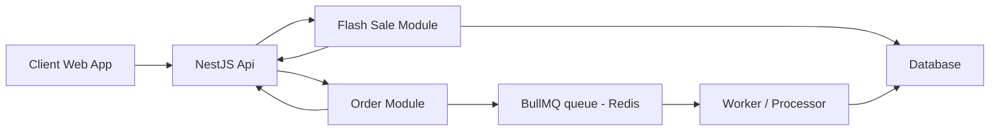

# Flash Sale API

## Description

A rest api to process flash sale orders of the client application. This project was build using nestjs.
BullMQ and Redis are used here to handle the load of multiple users trying to purchase the item.

The are some system limitation that need to note here.

- The job worker can only process 1 job at a time to handle overselling of item.
- In this case the processing will take some time to process every jobs.

## System diagram



## Project setup

```bash
$ npm install
```

## Setup Environment variable

1. Create new .env file
2. Copy the values from env.example
3. Change the nessesary value based on your local setup

## Migration

1. Run Table migration before running the app locally.

```bash
$ npx typeorm-ts-node-commonjs migration:run -d ormconfig.ts
```

2. Run the seeder. This will create new product and flash sale data in your database table.

```bash
$ npm run initialize-data
```

## Compile and run the project

```bash
# development
$ npm run start

# watch mode
$ npm run start:dev

# production mode
$ npm run start:prod
```

## Run tests

```bash
# unit tests
$ npm run test:unit

# integration tests
$ npm run test:e2e

# run stress test
# stress test needs your actual database data. Better to initialize the db data again before running this.
# before running this test, please make sure to open this file k6\orders.stress.test.js then follow the TODOs.
$ npm run test:stress
```

## Other available commands

### Create migration file

```bash
$  npx typeorm migration:create migrations/create-products-table
```

### Rollback migration

```bash
$ npx typeorm-ts-node-commonjs migration:revert -d ormconfig.ts
```
